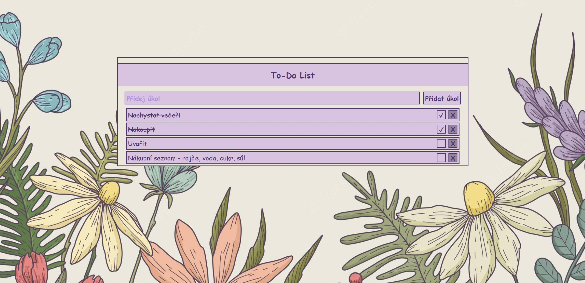

# To-Do List

Jednoduchá webová aplikace pro správu úkolů, vytvořená čistě pomocí HTML, CSS a JavaScriptu. Úkoly se ukládají v prohlížeči (localStorage), takže zůstanou zachované i po zavření stránky.



## Funkce

- Přidávání nových úkolů
- Mazání úkolů
- Označení úkolu jako hotový (checkbox + přeškrtnutí textu)
- Limit délky úkolu s upozorněním při dosažení maxima
- Data přetrvávají i po obnovení stránky (localStorage)

## Technologie

- HTML5
- CSS3 (Flexbox, CSS proměnné, vlastní stylování checkboxu)
- Vanilla JavaScript (DOM manipulace, localStorage, JSON)

## Jak spustit

1. Stáhni nebo naklonuj repozitář:
   ```bash
   git clone https://github.com/MatejPapezik/todo-list.git
   ```
2. Otevři `index.html` v prohlížeči (ideálně přes VS Code Live Server pro automatický reload)

## Co by se dalo vylepšit

- Editace existujícího úkolu (bez nutnosti smazat a vytvořit nový)
- Filtrování úkolů (zobrazit jen hotové / nehotové)
- Drag & drop pro přeřazení pořadí úkolů
- Backend a databáze pro sdílení úkolů mezi zařízeními

---

Vytvořeno jako trénink základů frontend vývoje 💪
